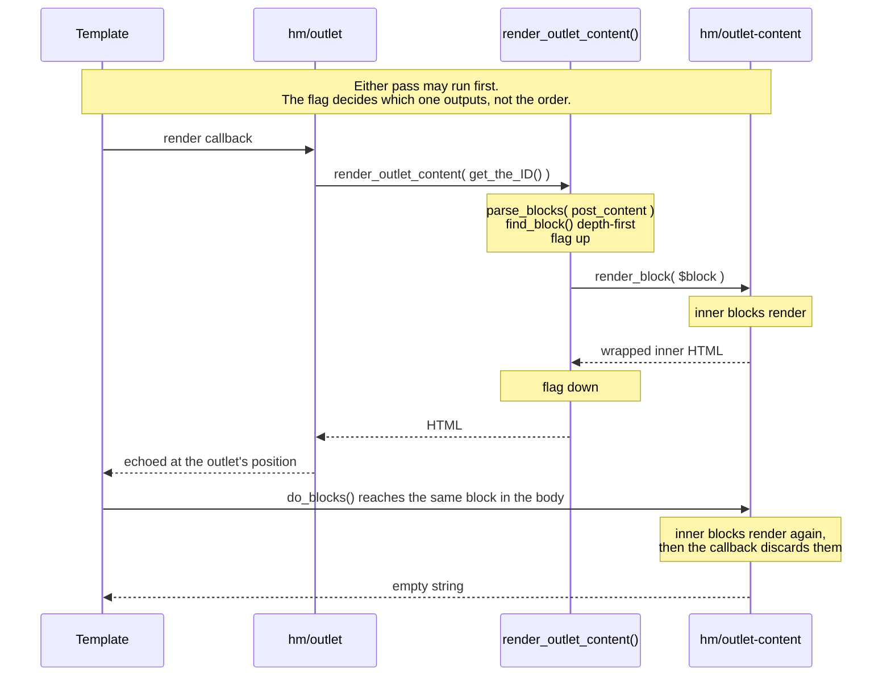

# Content Outlet Block

Have you ever wanted to take some part of your post content in a complex template, and output it separately from the rest of the main content area? Maybe you have a hero section that displays above some template chrome. You could bake all that into the content template, but that can require either brittle block locking, editorial discipline, or both if you want the template to be consistently applied across the site.

This plugin proposes a wrapper block which can hold any other block content, authored
anywhere within a post, and then an outlet block which can be used elsewhere in the page template to render the wrapped content at a fixed position.

Details on those blocks:

- **Outlet Content** (`hm/outlet-content`) wraps inner blocks in the post body. Renders nothing where it sits.
- **Outlet** (`hm/outlet`) is placed in a template *outside* `post_content`, _e.g._ above a wrapping columns unit in the single-post template. Renders the current post's wrapped Outlet Content blocks at that position.

The Outlet finds the content block by name, at any depth, so where the editor puts it in the body has no bearing on output. At present there can only be one content wrapper per post (`supports.multiple: false`), since the Outlet renders the first match.

## Architecture

Nothing is extracted as a string, and nothing is "moved". The same block is asked to render twice, and a flag decides which of those two attempts is the real one.

### The precondition

Outlet Content is a dynamic block that stores `<InnerBlocks.Content />` in its save method, to be able to persist wrapped content without any parent markup. The dynamic `render.php` logic chooses whether to render/output that wrapped content or not based on context at render time. When rendering _in situ_, `outlet-content/render.php` receives fully rendered inner HTML as `$content` and only has to wrap it.

### Layout context

Outlet Content registers layout support, and its own wide alignment, in JS rather than `block.json`, keeping both out of the server-side block type. Wide and full alignment are offered only where the parent supplies a `constrained` layout, and without one a nested Group, which aligns solely wide or full, has no alignment toolbar at all.

Declared in `block.json` the same support would apply on the front end, where WordPress stamps `is-layout-constrained` and its container classes onto the first tag of the output — the first child block, this block having no wrapper of its own. Split this way, the editor offers the controls and previews the wrapped blocks near their rendered width, while the front end leaves alignment to whatever contains the outlet.

### A single request



`is_rendering_via_outlet()` is a function-static toggled around that one `render_block()` call, not a request-level "already rendered" latch. So outlet placement relative to the Post Content block doesn't matter; the flag is only raised during the outlet's own call, and the body pass is suppressed no matter where the outlet is placed (before _vs_ after the post-content block). It would misbehave only if something rendered post content *inside* the outlet's `render_block()` call, which&hellip; don't do that `:)`.

### Costs

- `post_content` is parsed twice per request: once by `do_blocks()`, once by the outlet's lookup.
- **The suppressed pass is not free.** `WP_Block::render()` renders inner blocks *before* calling the block's render callback, so the wrapped subtree **renders a second time** during the post body pass and the result is thrown away. This is fine for static blocks or cheap-generation dynamic blocks, but be aware that an expensive Query Loop, remote fetch, or anything else complex inside the wrapper will be triggered twice.
- `render_block()` is called with no explicit context array, so a nested dynamic child relying on `usesContext` (`postId`, `postType`) gets an empty context and falls back to its own default.
- The lookup is by name, so the block's index in the post is never read.

## Development

Installing build dependencies and building the compiled asset bundles
```bash
npm install
npm run build # or: npm run start
```

Checking code for style, syntax and safety
```
composer install
composer phpcs
npm run lint:js
```

### Local Environment

This project uses [wp-env](https://developer.wordpress.org/block-editor/reference-guides/packages/packages-env/) to run a lightweight, containerized WordPress instance at [localhost:6858](http://localhost:6858) for testing purposes. The default username for the localhost environment is `admin`, with the password `password`.

These commands can be used to interact with the environment:

Command | Purpose
---- | ----
`npm run env:start` | Start the local environment at http://localhost:6858
`npm run env:stop` | Turn off the local environment
`npm run env:cli -- wp ...` | Run WP-CLI commands within the environment
`npm run env:logs` | Open (and tail) the error logs for the application<sup>&ddagger;</sup>
`npm run env:db` | Open the database in the mysql command line
`npm run env:destroy` | Fully destroy the local environment (deletes container database)

<sup>&ddagger;</sup> This command deliberately filters out GET/OPTIONS/HEAD/POST/PUT access log entries

## Release Process

Code merged to `main` automatically builds to the `release` branch via GitHub Actions; `release` is what Composer installs.

Tag versions with the [**Tag and Release** workflow](https://github.com/humanmade/content-outlet-block/actions) after bumping the version number in `plugin.php`.
